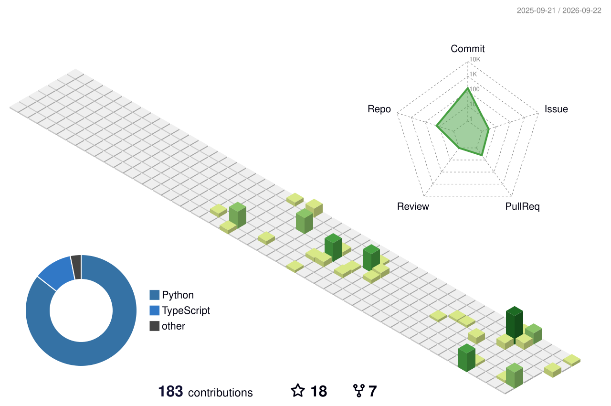
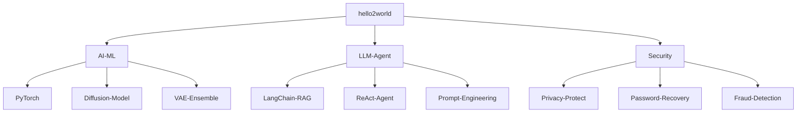

<!--  GitHub Profile README — 风格参考 github.com/BEPb/BEPb  -->


<!--   my-icons   -->
<p align="center">
    <a href="https://github.com/helloe365"></a>
    <a href="https://www.python.org/"></a>
    <a href="https://github.com/helloe365?tab=repositories"></a>
    
</p>

<!--   my-ticker   -->
<p align="center">
<a href="https://git.io/typing-svg"></a>
</p>

---

## 👨‍💻 关于我 | About Me

<table>
<tr>
<td width="35%" align="center">


<p align="center"><strong>「 Stay hungry, Stay foolish. 」</strong></p>

</td>
<td width="65%">

```text
🧑‍💻  Name       →  hello2world
🔭  Focus      →  AI / 机器学习 / LLM 应用开发
🌱  Learning   →  RAG · Agent · 深度学习
🛡   Interest   →  数据安全与隐私保护
💬  Ask me     →  Python · LangChain · PyTorch
📫  Email      →  helloe2718@gmail.com
```

</td>
</tr>
</table>

---

## 🛠️ 技术栈 | Tech Stack

<div align="center">

[](https://skillicons.dev)

</div>

| 分类 | 技术 |
|:---|:---|
| **Languages** |     |
| **AI / Deep Learning** |      |
| **LLM / Agent** |      |
| **Data** |     |
| **Security** |    |
| **OS** |   |

---

## 🚀 精选项目 | Featured Projects

<p>
  <a href="https://github.com/helloe365/CrackPDFPassword"></a>
  <a href="https://github.com/helloe365/RagAgent"></a>
</p>
<p>
  <a href="https://github.com/helloe365/AdaptiveFinancialFraudDetectionSystem"></a>
  <a href="https://github.com/helloe365/BigDataSecurityPrivacyInclude"></a>
</p>

---

## 📊 GitHub 统计 | GitHub Stats

<p>
  
  
</p>

<p>
  
</p>

## 🐍 贪吃蛇吃掉我的贡献格 | Contribution Snake

<picture>
  <source media="(prefers-color-scheme: dark)" srcset="https://raw.githubusercontent.com/helloe365/helloe365/output/github-contribution-grid-snake-dark.svg">
  <source media="(prefers-color-scheme: light)" srcset="https://raw.githubusercontent.com/helloe365/helloe365/output/github-contribution-grid-snake.svg">
  
</picture>

*由 GitHub Actions 每天自动重新生成 🔄*

## 🧊 3D 贡献图 | 3D Contributions



*同样由 GitHub Actions 自动生成 🔄*

---

## 🧠 技术图谱 | Knowledge Map



---

## 📫 联系我 | Reach Me

<p>
  <a href="mailto:helloe2718@gmail.com"></a>
  <a href="https://github.com/helloe365"></a>
</p>

### 📍 My Location

<p align="center">
  <a href="https://www.openstreetmap.org/?mlat=28.024557&mlon=112.937019#map=15/28.024557/112.937019">
    
  </a>
</p>

<p align="center"><strong>湖南大学科创港校区</strong> · 28.024557°N, 112.937019°E</p>

---

<div align="center">

### ❤️ Thanks for visiting!


*如果喜欢这个主页，欢迎 Star ⭐ 本仓库！*


</div>
