<!-- Animated art in ./assets is generated by scripts/generate_assets.py (deterministic, offline).
     Stats cards in ./stats are regenerated daily by .github/workflows/generate-stats.yml. -->

<picture>
  <source media="(prefers-color-scheme: light)" srcset="./assets/hero-light.svg">
  
</picture>

  
  
  
  

<picture>
  <source media="(prefers-color-scheme: light)" srcset="./assets/divider-light.svg">
  
</picture>

## 👨‍💻 About Me

<picture>
  <source media="(prefers-color-scheme: light)" srcset="./assets/terminal-light.svg">
  
</picture>

- 🌱 **Learning** — RAG · Agents · Deep Learning (Diffusion Models, VAE)
- 🏗 **Shipping** — [CrackPDFPassword](https://github.com/helloe365/CrackPDFPassword), an open-source PDF password recovery tool at **16★ / 7 forks**
- 💬 **Ask me about** — Python · LangChain · PyTorch · Streamlit · hashcat
- 📍 **Where** — Hunan University, Sci-Tech Innovation Port Campus · Changsha, China

<picture>
  <source media="(prefers-color-scheme: light)" srcset="./assets/divider-light.svg">
  
</picture>

## 🚀 Featured Projects

  <a href="https://github.com/helloe365/CrackPDFPassword">
    <picture>
      <source media="(prefers-color-scheme: light)" srcset="./stats/pin-CrackPDFPassword-light.svg">
      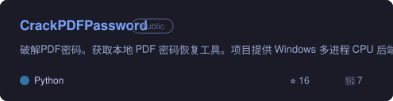
    </picture>
  </a>
  <a href="https://github.com/helloe365/CupLens">
    <picture>
      <source media="(prefers-color-scheme: light)" srcset="./stats/pin-CupLens-light.svg">
      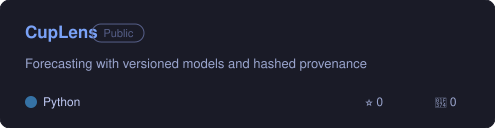
    </picture>
  </a>

  <a href="https://github.com/helloe365/RagAgent">
    <picture>
      <source media="(prefers-color-scheme: light)" srcset="./stats/pin-RagAgent-light.svg">
      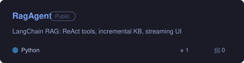
    </picture>
  </a>
  <a href="https://github.com/helloe365/AdaptiveFinancialFraudDetectionSystem">
    <picture>
      <source media="(prefers-color-scheme: light)" srcset="./stats/pin-AdaptiveFinancialFraudDetectionSystem-light.svg">
      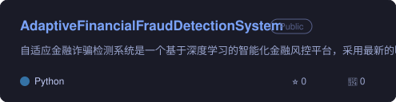
    </picture>
  </a>

Cards regenerate daily via GitHub Actions 🔄

<picture>
  <source media="(prefers-color-scheme: light)" srcset="./assets/divider-light.svg">
  
</picture>

## 🛠️ Tech Stack

  <a href="https://skillicons.dev">
    <picture>
      <source media="(prefers-color-scheme: light)" srcset="https://skillicons.dev/icons?i=python%2Cpytorch%2Ctensorflow%2Csklearn%2Copencv%2Clinux%2Cgit%2Cgithub%2Cgithubactions%2Csqlite%2Cvscode&perline=11&theme=light">
      
    </picture>
  </a>

| Area                         | Tools                                                                                                                                                                                                                                                                                                                                                                                                                                                                                                                                                                         |
| :--------------------------- | :---------------------------------------------------------------------------------------------------------------------------------------------------------------------------------------------------------------------------------------------------------------------------------------------------------------------------------------------------------------------------------------------------------------------------------------------------------------------------------------------------------------------------------------------------------------------------- |
| **Languages**          |                                                                                                                                                                                               |
| **AI / Deep Learning** |       |
| **LLM / Agent**        |                                                                                                                            |
| **Data**               |                                                                                                                                                                                                 |
| **Security**           |                                                                                                                                                                                                                                                                                           |
| **OS / Tools**         |                                                                                                                                                                                                                                                                                                                                                                                  |

<picture>
  <source media="(prefers-color-scheme: light)" srcset="./assets/divider-light.svg">
  
</picture>

## 📊 GitHub Stats

  <picture>
    <source media="(prefers-color-scheme: light)" srcset="./stats/stats-light.svg">
    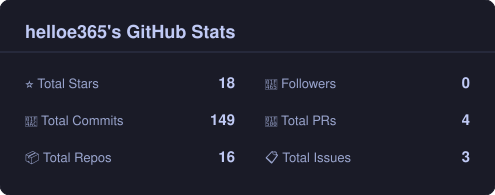
  </picture>
  <picture>
    <source media="(prefers-color-scheme: light)" srcset="./stats/top-langs-light.svg">
    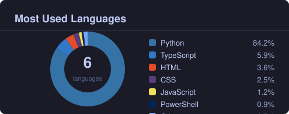
  </picture>

### 🏙️ Contribution City

<picture>
  <source media="(prefers-color-scheme: light)" srcset="./profile-3d-contrib/profile-season-animate.svg">
  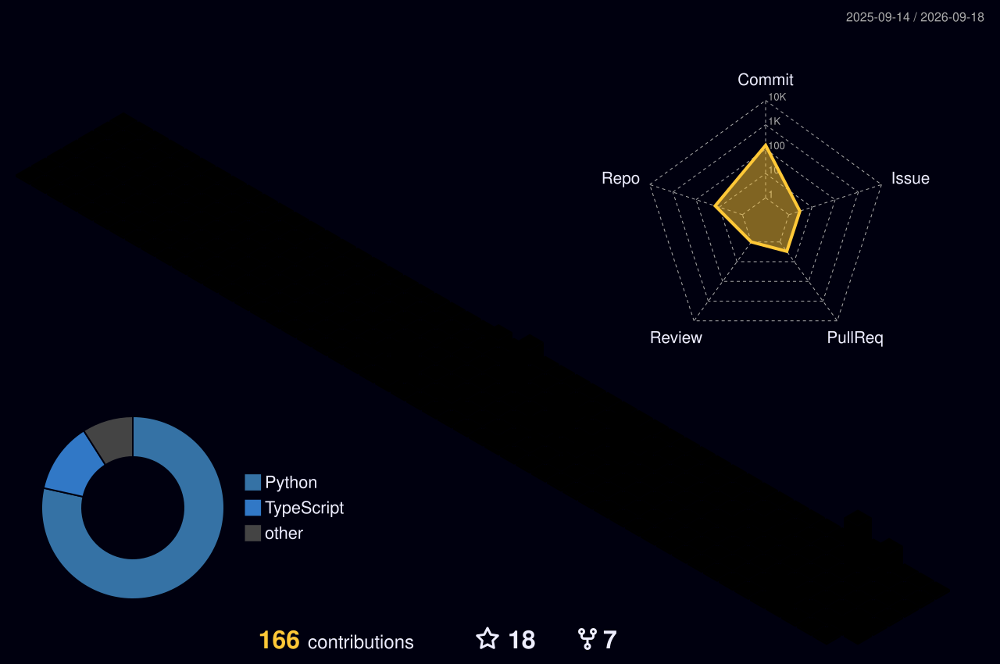
</picture>

### 📈 Contribution Activity

<picture>
  <source media="(prefers-color-scheme: light)" srcset="./stats/activity-light.svg">
  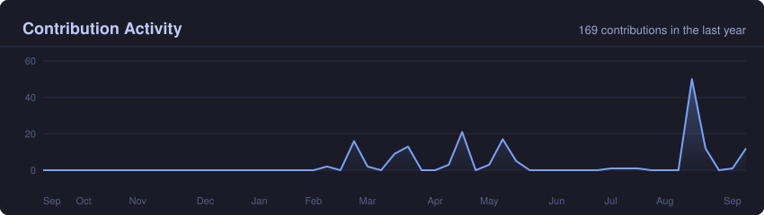
</picture>

### 🏆 Trophies

<picture>
  <source media="(prefers-color-scheme: light)" srcset="./stats/trophies-light.svg">
  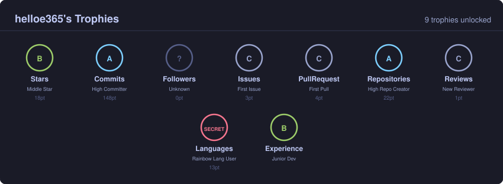
</picture>

### 🐍 Contribution Snake

<picture>
  <source media="(prefers-color-scheme: dark)" srcset="https://raw.githubusercontent.com/helloe365/helloe365/output/github-contribution-grid-snake-dark.svg">
  <source media="(prefers-color-scheme: light)" srcset="https://raw.githubusercontent.com/helloe365/helloe365/output/github-contribution-grid-snake.svg">
  
</picture>

<picture>
  <source media="(prefers-color-scheme: light)" srcset="./assets/divider-light.svg">
  
</picture>

## 📫 Contact

  
  

<picture>
  <source media="(prefers-color-scheme: light)" srcset="./assets/footer-light.svg">
  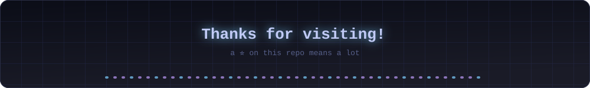
</picture>
